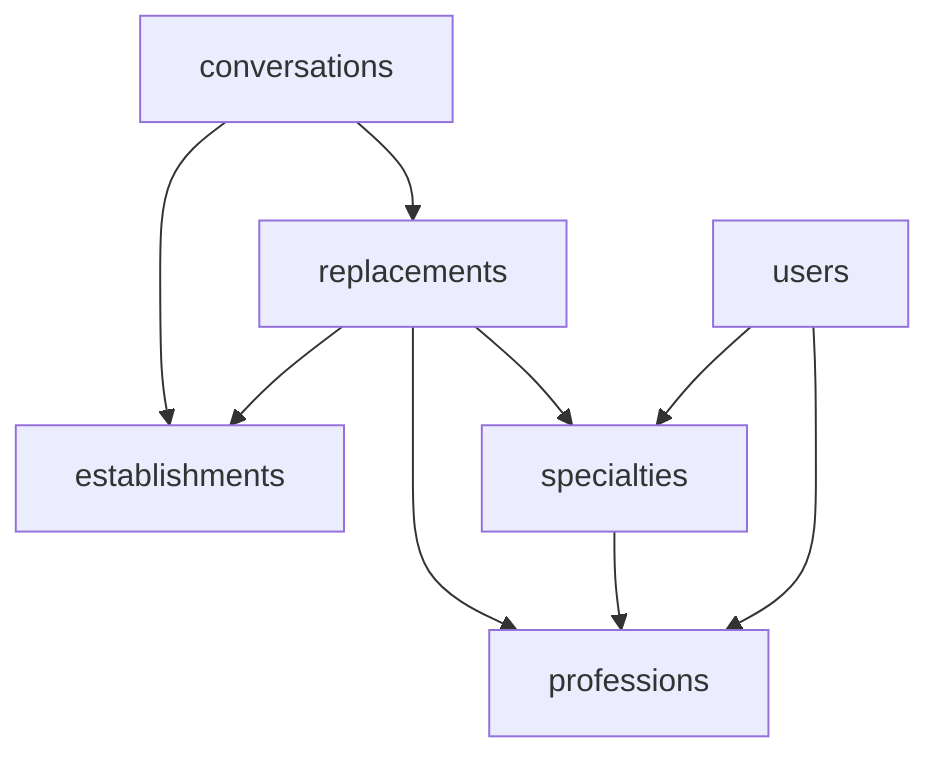

# Structure de la base de données Firebase

Ce document décrit la structure des collections et des documents dans notre base de données Firebase.

_Document généré automatiquement le 08/02/2025 à 14:53_

## Vue d'ensemble

La base de données contient les collections principales suivantes :

- `conversations` : Gestion des conversations entre utilisateurs
- `establishments` : Gestion des établissements de santé
- `professions` : Gestion des professions médicales
- `replacements` : Gestion des offres de remplacement
- `specialties` : Gestion des spécialités médicales
- `users` : Gestion des utilisateurs

## Relations entre collections

## Détails des collections

### Collection: `users`

#### Structure des documents

| Champ | Type | Description | Exemple |
|-------|------|-------------|----------|
| `uid` | string | Identifiant unique de l'utilisateur | "2KIBpIsOHCRJqrVo0nBqUmCnBX42" |
| `email` | string | Adresse email de l'utilisateur | "david-dumas29@hotmail.fr" |
| `firstName` | string | Prénom de l'utilisateur | "David" |
| `lastName` | string | Nom de l'utilisateur | "Dumas" |
| `birthDate` | datetime | Date de naissance | "2000-02-03 23:00:00" |
| `professionId` | string | Référence vers la profession | "prf1mN5pQ8sT3vW6xY9" |
| `specialityIds` | list[string] | Liste des spécialités de l'utilisateur | - |
| `role` | string | Rôle de l'utilisateur | "user" |
| `isProfileComplete` | boolean | État de complétion du profil | true |
| `onboardingStep` | integer | Étape d'onboarding actuelle | 0-3 |
| `createdAt` | datetime | Date de création du compte | "2025-02-06 15:10:07" |
| `updatedAt` | datetime | Date de dernière mise à jour | "2025-02-06 15:34:49" |

### Collection: `establishments`

#### Structure des documents

| Champ | Type | Description | Exemple |
|-------|------|-------------|----------|
| `id` | string | Identifiant unique | "est1xKj2mP9nQ8rL5vW4" |
| `name` | string | Nom de l'établissement | "Hôpital de la Timone" |
| `address` | string | Adresse complète | "264 Rue Saint-Pierre, 13005 Marseille" |
| `description` | string | Description détaillée | "Plus grand hôpital de la région PACA..." |
| `coordinates` | dict | Coordonnées géographiques | - |
| `professionIds` | list[string] | Liste des professions disponibles | - |
| `image` | integer | ID de l'image | 22 |
| `createdAt` | datetime | Date de création | "2025-02-02 11:27:41" |
| `updatedAt` | datetime | Date de mise à jour | "2025-02-02 11:27:41" |

### Collection: `professions`

#### Structure des documents

| Champ | Type | Description | Exemple |
|-------|------|-------------|----------|
| `id` | string | Identifiant unique | "prf1mN5pQ8sT3vW6xY9" |
| `name` | string | Nom de la profession | "Imagerie médicale" |
| `description` | string | Description détaillée | "Spécialiste en imagerie médicale" |
| `icon` | string | Icône associée | "radiology" |
| `createdAt` | datetime | Date de création | "2025-02-02 11:27:41" |
| `updatedAt` | datetime | Date de mise à jour | "2025-02-02 11:27:41" |

### Collection: `specialties`

#### Structure des documents

| Champ | Type | Description | Exemple |
|-------|------|-------------|----------|
| `id` | string | Identifiant unique | "spc1xA4yB7zC2wD9vE6" |
| `name` | string | Nom de la spécialité | "Scanner" |
| `description` | string | Description détaillée | "Imagerie par tomodensitométrie" |
| `slug` | string | Identifiant URL-friendly | "scanner" |
| `icon` | string | Icône associée | "scan-outline" |
| `professionId` | string | Référence vers la profession | "prf1mN5pQ8sT3vW6xY9" |
| `isActive` | boolean | État d'activation | true |
| `createdAt` | datetime | Date de création | "2025-02-02 11:27:41" |
| `updatedAt` | datetime | Date de mise à jour | "2025-02-02 11:27:41" |

### Collection: `replacements`

#### Structure des documents

| Champ | Type | Description | Exemple |
|-------|------|-------------|----------|
| `id` | string | Identifiant unique | "rep1bN0cP3dQ6eR9fS2" |
| `title` | string | Titre de l'annonce | "Remplacement Scanner/IRM" |
| `description` | string | Description détaillée | "Remplacement pour congés, service de radiologie..." |
| `establishmentId` | string | Référence établissement | "est1xKj2mP9nQ8rL5vW4" |
| `professionId` | string | Référence profession | "prf1mN5pQ8sT3vW6xY9" |
| `specialtyId` | string | Référence spécialité | "spc1xA4yB7zC2wD9vE6" |
| `startDate` | datetime | Date de début | "2024-03-15 00:00:00" |
| `endDate` | datetime | Date de fin | "2024-03-20 00:00:00" |
| `status` | string | État du remplacement | "open" |
| `urgency` | string | Niveau d'urgence | "normal" ou "high" |
| `workload` | dict | Détails charge de travail | - |
| `rate` | dict | Informations tarification | - |
| `periods` | list[string] | Périodes de travail | - |
| `name` | string | Nom court | "IRM La Timone" |
| `createdAt` | datetime | Date de création | "2025-02-02 11:27:41" |
| `updatedAt` | datetime | Date de mise à jour | "2025-02-02 11:27:41" |

### Collection: `conversations`

#### Structure des documents

| Champ | Type | Description | Exemple |
|-------|------|-------------|----------|
| `id` | string | Identifiant unique | "conv1" |
| `lastMessage` | dict | Dernier message | - |
| `establishmentId` | string | Référence établissement | "est1xKj2mP9nQ8rL5vW4" |
| `replacementId` | string | Référence remplacement | "rep1bN0cP3dQ6eR9fS2" |
| `participants` | list[string] | Liste des participants | - |
| `status` | string | État de la conversation | "active" ou "closed" |
| `lastActivity` | datetime | Dernière activité | "2025-02-05 18:15:44" |
| `createdAt` | datetime | Date de création | "2024-02-01 08:00:00" |
| `updatedAt` | datetime | Date de mise à jour | "2024-02-01 09:30:00" |

#### Sous-collections

##### messages
- Structure non détaillée dans l'analyse

## Notes techniques

1. **Gestion des dates**
   - Toutes les collections utilisent `createdAt` et `updatedAt`
   - Les dates sont stockées au format datetime

2. **Relations entre collections**
   - Utilisation d'IDs de référence (ex: professionId, establishmentId)
   - Relations multiples possibles via listes (ex: specialityIds)

3. **Système de statuts**
   - Remplacements : "open", autres statuts possibles
   - Conversations : "active", "closed"

4. **Système d'onboarding**
   - Suivi de la progression via `onboardingStep` (0-3)
   - Validation du profil via `isProfileComplete`

5. **Sécurité et rôles**
   - Système de rôles utilisateur implémenté
   - Gestion des états actif/inactif pour les spécialités

